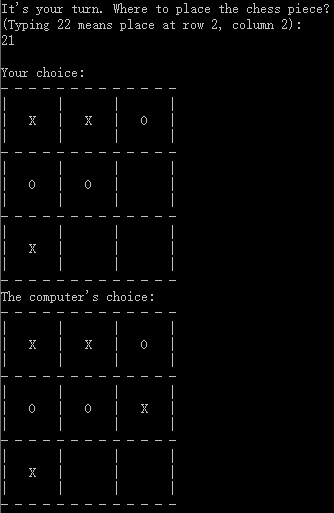

# TicTacToe-AI

A tic-tac-toe game AI written in c/c++.

## Demos



## Compile and Run

Windows:

    Compile and run with Visual Studio or g++.
    
Linux:

```bash
$ cd src
$ make
$ make run
$ make clean
```

## References

* [minimax algorithm](https://en.wikipedia.org/wiki/Minimax)
* [alpha-beta pruning](https://en.wikipedia.org/wiki/Alpha%E2%80%93beta_pruning)
